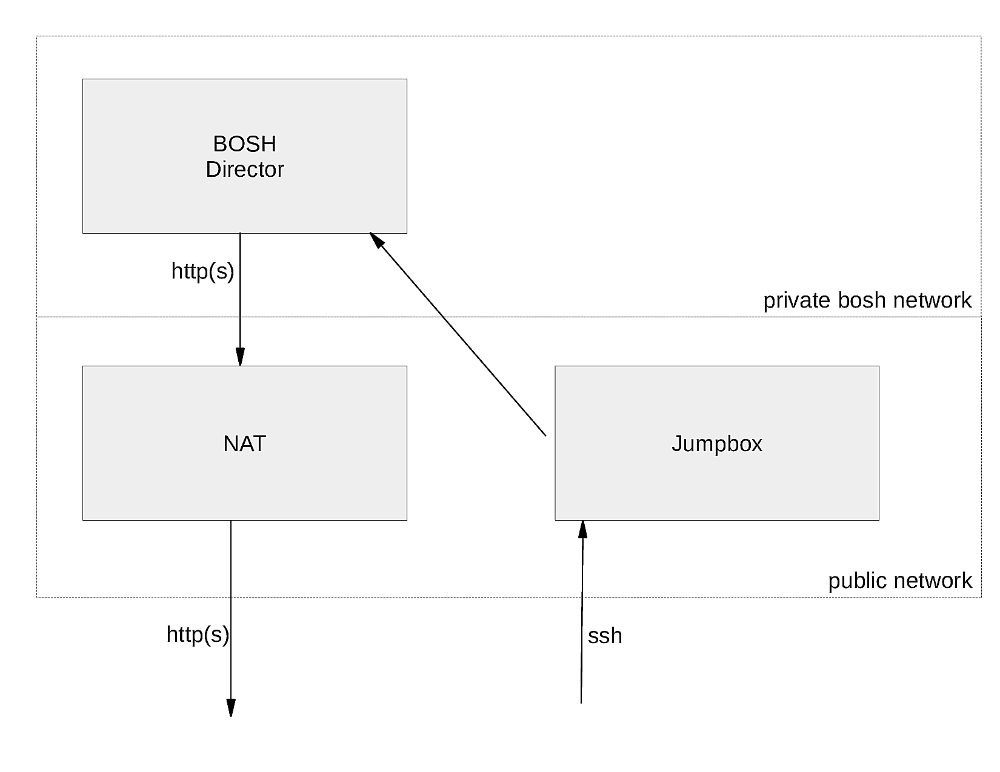

# Tutorial: Deploy BOSH and UAA on AWS with Terraform #

[](https://travis-ci.org/ottenwbe/bosh-install)

__NOTE: This tutorial and all scripts are still WIP!__

Modern cloud applications are inherently distributed and typically need 
to spin up a large number of virtual machines to deploy all required software components.
[_Bosh_](http://bosh.io) is often the tool of choice in these scenarios to orchestrate the application and/or depending software components like data bases. 
Bosh supports a cloud application in the release engineering, deployment, and lifecycle management.

Deploying bosh on [AWS](https://aws.amazon.com/) requires that you set up your basic infrastructure (network, firewalling, key pairs, ...) beforehand. You can choose to do this manually. 
However, the better approach is to rely on an IaaS automation tool like [_terraform_](http://terraform.io). 
This allows you to define your AWS infrastructure as code.
Which, in turn, makes the infrastructure configuration reproducible and testable.

In this tutorial I explain how you can setup a bosh environment on AWS with terraform. The environment, comprising the basic infrastructure, the bosh director, and a simple bosh release, can then be installed with the execution of a shell script.
For those interested in setting up the bosh environment manually, I provide an additional tutorial (see [Manual Deployment](MANUAL.md)).

## A Word of Caution ##

Before you follow the steps in this tutorial you should be aware that you will create real resources on AWS that cost money. 
In particular, the tutorial requires that you deploy more resources than included in Amazon's free tier, i.e., two t2.small and one m3.xlarge instance. 
Obviously, I will not provide compensation for any costs.  

## Dependencies ##

The tutorial will make use of the following software components. 
No worries, you do not need to install them right now.
We come back to the individual tools when we need them.

| Component  | URL | Purpose |
|---|---|---|
| Bosh  | [http://bosh.io](http://bosh.io)  | The service we want to deploy on AWS |
| Terraform  |  [http://terraform.io](http://terraform.io) | Bootstrapping of the bosh infrastructure |
| Bosh Deployment  | [https://github.com/cloudfoundry/bosh-deployment](https://github.com/cloudfoundry/bosh-deployment)  | Bosh templates for the deployment of bosh |
| UAA  |  [https://github.com/cloudfoundry/uaa](https://github.com/cloudfoundry/uaa) | (optional) User management for bosh |   
| Bosh Dummy Release  |   [https://github.com/pivotal-cf-experimental/dummy-boshrelease](https://github.com/pivotal-cf-experimental/dummy-boshrelease)  | (optional) Release for testing bosh |

## Target Environment ##



In its target state your environment will consist of three VMs, a _jumpbox instance_, a _nat instance_, and a _bosh-director_. 
With this setup you can immediately deploy bosh releases.

The jumpbox instance allows you to access the environment via ssh. The VM is therefore placed in a public network.
You can think of the jumpbox as your command central. 
The jumpbox has all tools installed to manage bosh, including a uuac cli to manage the UAA.

The bosh director is placed in a private network to prevent direct access from the internet to the bosh deployed vms.
For the sake of simplicity we assume that you only want to deploy bosh releases in a private network.   

Ultimately this setup would prevent bosh vms from downloading additional software components, i.e., stemcells or bosh releases, since the bosh director cannot be accessed from the internet. This is where the NAT instance shines. 
It allows your bosh director to access the internet via http(s); but no other protocol.

    
## Automated Deployment of the Environment ##

Let's take a deeper look at how you can automate the setup of the bosh environment.
For the impatient I prepared a [quick start guide](QUICKSTART.md).
     
### Preparations ###    

In order to be able to follow the steps in this tutorial you should prepare a local Linux system as follows:

1. Create the following folder structure that is used throughout the tutorial:
        
    ```
    bosh-install/   Scripts that trigger the rollout and destruction of the environment on AWS
    └── src/        All terraform resources and corresponding scripts
        ├── bin/    Scripts that are executed on ec2 instances after the latter's launch
        └── ssh/    Generated ssh keys        
    ```
    
    You can always have a peek at a reference implementation of the environment when you clone the git repository of this tutorial.
        
    ```bash
    git clone https://github.com/ottenwbe/bosh-install.git
    cd bosh-install
    ```

1. Install [terraform](https://www.terraform.io/intro/getting-started/install.html) if you haven't done that already.

    ```bash
    curl -fSL "https://releases.hashicorp.com/terraform/0.8.8/terraform_0.8.8_linux_amd64.zip" -o terraform.zip
    sudo unzip terraform.zip -d /opt/terraform
    sudo ln -s /opt/terraform/terraform /usr/bin/terraform
    rm -f terraform.zip
    ```

1. Create an IAM user with your AWS console. There are several good tutorials out there that can help you with that, e.g., https://bosh.io/docs/aws-iam-users.html#create

1. Create a local file ```src/terraform.tfvars``` to hold your aws credentials. Otherwise you have to retype the credentials with every change.

    ```bash
    cd src
    touch terraform.tfvars
    echo "access_key=...
    secret_key=..." >> terraform.tfvars
    ```

    You will parse the variables when destroying the environment. To this end, make sure that there is no whitespace in each line of terraform.tfvars.
    This also means, if you do not want to keep your credentials in a file, you have to modify parts of the scripts!


### The One with the Infrastructure as Code ###

The basic infrastructure is defined in Hashicorp's HCL. 
In particular, 
the vpc, network, firewalls, the jumpbox instance, and the nat instance. 
The bosh-director, however, is rolled out using the [bosh cli v2](https://github.com/cloudfoundry/bosh-cli).
The following sections describe how you can organize and define terraform files (*tf).

#### Variables ###

At first define some basic variables in a file ```src/variables.tf```. 
Terraform allows you to later reference the variables in other files.
Observe that I defined in the example specific ips and ip ranges for the different subnets.

```hcl
/** Access key. NOTE: DO NOT DECLARE YOUR ACTUAL KEY HERE */
variable "access_key" {
  description = "Access Key"
}

/** Secret key. NOTE: DO NOT DECLARE YOUR ACTUAL KEY HERE */
variable "secret_key" {
  description = "Secret Access"
}

variable "default_az" {
  description = "Default availability zone which is used during the deployment"
  default     = "eu-central-1a"
}

variable "region" {
  description = "AWS region to host the bosh environment"
  default     = "eu-central-1"
}

variable "vpc_gw" {
  description = "Gateway for the vpc"
  default     = "10.0.0.1"
}

variable "bosh_gw" {
  description = "Gateway for the bosh network"
  default     = "10.0.1.1"
}

variable "bosh_ip" {
  description = "Bosh director IP"
  default     = "10.0.1.6"
}

variable "vpc_cidr" {
  description = "CIDR for VPC"
  default     = "10.0.0.0/16"
}

variable "bosh_subnet_cidr" {
  description = "CIDR for bosh subnet"
  default     = "10.0.1.0/24"
}

variable "public_subnet_cidr" {
  description = "CIDR for public subnet"
  default     = "10.0.0.0/24"
}

/* Ubuntu amis by region */
variable "amis" {
  type        = "map"
  description = "Base AMI to launch the vms"

  default = {
    eu-central-1 = "ami-829145ed"
  }
}
```

#### The VPC ###

As a first resource you should define the provider (aws) and a virtual private cloud (vpc).
In the example this is defined in the file ```src/aws-vpc.tf```.
As you can see in the code snippet below, we simply reference variables
that are defined in the file variables.tf (Syntax: "${var.\<variable name\>}"). 

```hcl
provider "aws" {
  access_key = "${var.access_key}"
  secret_key = "${var.secret_key}"
  region     = "${var.region}"
}

resource "aws_vpc" "default" {
  cidr_block           = "${var.vpc_cidr}"
  enable_dns_hostnames = true

  tags {
    Name = "bosh-terraform-vpc"
  }
}
```

#### Security Groups ###

As a second resource you need to define which inbound/outbound traffic is allowed in your bosh environment. 
This can be done with security groups. In the example we declare them in the file ```src/security-groups.tf```. 
You can associate these security groups to vms in order to put them into effect.

You have to define three security groups. 
First, the ```ssh``` group which allows inbound ssh traffic from the all destinations in the internet to a vm.

```hcl
resource "aws_security_group" "ssh" {
  name        = "ssh"
  description = "SSH access to instances from the internet"
  vpc_id      = "${aws_vpc.default.id}"
  
  ingress {
    from_port = 22
    to_port   = 22
    protocol  = "tcp"

    cidr_blocks = [
      "0.0.0.0/0",
    ]
  }

  tags {
    Name = "ssh sg"
  }

}
```

Second, a ```nat``` rule, which allows http(s) traffic to servers outside of your vpc.

```hcl
/* Security group for the nat instance */
resource "aws_security_group" "vpc_nat" {
  name        = "vpc_nat"
  description = "Allow traffic to pass from the private subnet to the internet"
  vpc_id      = "${aws_vpc.default.id}"
  
  egress {
    from_port   = 80
    to_port     = 80
    protocol    = "tcp"
    cidr_blocks = ["0.0.0.0/0"]
  }

  egress {
    from_port   = 443
    to_port     = 443
    protocol    = "tcp"
    cidr_blocks = ["0.0.0.0/0"]
  }

  tags {
    Name = "NATSG"
  }
}
```

Third, an any-to-any connection between all ```bosh``` instances. 
For improved security you can always add more specific rules here.

```hcl
resource "aws_security_group" "bosh" {
  name        = "bosh"
  description = "Security group for bosh vms"
  vpc_id      = "${aws_vpc.default.id}"

  ingress {
    from_port = "0"
    to_port   = "0"
    protocol  = "-1"
    self      = true
  }

  egress {
    from_port = "0"
    to_port   = "0"
    protocol  = "-1"
    self      = true
  }

  tags {
    Name = "bosh sg"
  }
}
```

#### Subnets ###

Recall, the target environment comprises two networks.
The public network for the internet facing systems, 
i.e., the nat instance, and the private network for bosh.
In the example those networks are defined in the file ```src/subnets.tf```.  

```hcl
/** public subnet for the nat instance and the jumpbox */
resource "aws_subnet" "public" {
  vpc_id                  = "${aws_vpc.default.id}"
  cidr_block              = "${var.public_subnet_cidr}"
  availability_zone       = "${var.default_az}"
  map_public_ip_on_launch = true
  depends_on              = ["aws_internet_gateway.default"]

  tags {
    Name = "public-net"
  }
}

/** private network for the bosh managed vms */
resource "aws_subnet" "bosh" {
  vpc_id                  = "${aws_vpc.default.id}"
  cidr_block              = "${var.bosh_subnet_cidr}"
  availability_zone       = "${var.default_az}"
  map_public_ip_on_launch = false
  depends_on              = ["aws_instance.nat"]

  tags {
    Name = "bosh-net"
  }
}
```

Routing tables ensure that the traffic from the private network towards the internet
is routed over the nat instance.

```hcl
resource "aws_route_table" "public" {
  vpc_id = "${aws_vpc.default.id}"

  route {
    cidr_block = "0.0.0.0/0"
    gateway_id = "${aws_internet_gateway.default.id}"
  }
}

resource "aws_route_table" "bosh" {
  vpc_id = "${aws_vpc.default.id}"

  route {
    cidr_block  = "0.0.0.0/0"
    instance_id = "${aws_instance.nat.id}"
  }

  tags {
    Name = "Private Subnet"
  }
}

resource "aws_route_table_association" "public" {
  subnet_id      = "${aws_subnet.public.id}"
  route_table_id = "${aws_route_table.public.id}"
}

resource "aws_route_table_association" "bosh" {
  subnet_id      = "${aws_subnet.bosh.id}"
  route_table_id = "${aws_route_table.bosh.id}"
}
```

Lastly the internet gateway needs to be defined. 

```hcl
resource "aws_internet_gateway" "default" {
  vpc_id = "${aws_vpc.default.id}"
}
```

#### Key Pairs ###

For ssh access to the instances you need to define key pairs. 
Create two key pairs, one for bosh
and one for the instances in the public network.
This step is optional, as the final script that rolls out the environment can do that for you.  

```bash
ssh-keygen -t rsa -C "deployer" -P '' -f src/ssh/deployer -b 4096
ssh-keygen -t rsa -C "bosh" -P '' -f src/ssh/bosh -b 4096
```

However, you have to define resources for the key pairs, e.g., in the file ```src/key-pairs.tf```. 

```hcl
/** key for deployment of jumpbox and nat */
resource "aws_key_pair" "deployer" {
  key_name   = "deployer"
  public_key = "${file("ssh/deployer.pub")}"
}

/** key for bosh */
resource "aws_key_pair" "bosh" {
  key_name   = "bosh"
  public_key = "${file("ssh/bosh.pub")}"
}
```

### The instances ###

Finally, you have everything prepared to define the _jumpbox_ and _nat_ instances.  Both instances will select the ami for eu-central and are of type t2.micro. Both instances are also placed in the public subnet.
 
A cool thing about security groups is that you can combine them as needed when associating them to instances. 
The jumpbox can be accessed via ssh and 
can communicate with bosh instances by 
assigning both, the nat and ssh security group to the instance.

Note that we declare an explicit relation between the instances with the ```depends_on``` key word. The nat instance will be launched before the jumpbox. 
You will see that this is necessary for deploying the bosh-director from the jumpbox, since we use the bosh cli and not terraform for provisioning this vm 
and need to assure that all prerequisites are up and running.

```hcl
/** jumpbox instance */
resource "aws_instance" "jumpbox" {
  ami                    = "${lookup(var.amis, var.region)}"
  availability_zone      = "${var.default_az}"
  instance_type          = "t2.micro"
  subnet_id              = "${aws_subnet.public.id}"
  vpc_security_group_ids = ["${aws_security_group.bosh.id}", "${aws_security_group.vpc_nat.id}", "${aws_security_group.ssh.id}"]
  key_name               = "${aws_key_pair.deployer.key_name}"
  
  /* ensure that both, nat instance and network, are up and running */
  depends_on = ["aws_instance.nat", "aws_subnet.bosh"]

/**
  provisioners "remote-exec" {
    ... see section about provisioners for details
  }
*/
}
```

For your nat instance the ```source_dest_check``` is to be set to false since you want to pass traffic through the instance.

```hcl
/** nat instance */
resource "aws_instance" "nat" {
  ami                         = "${lookup(var.amis, var.region)}"
  availability_zone           = "${var.default_az}"
  instance_type               = "t2.micro"
  vpc_security_group_ids      = ["${aws_security_group.bosh.id}", "${aws_security_group.vpc_nat.id}", "${aws_security_group.ssh.id}"]
  subnet_id                   = "${aws_subnet.public.id}"
  associate_public_ip_address = true
  source_dest_check           = false
  key_name                    = "${aws_key_pair.deployer.key_name}"

  /*provisioner "remote-exec" {
   ... see section about provisioners for details
  }*/

  tags {
    Name = "VPC NAT"
  }
}
```

You also need to allocate an elastic ip for the nat instance.

```hcl
resource "aws_eip" "nat" {
  instance = "${aws_instance.nat.id}"
  vpc      = true
}
```

#### Provisioners ####

For now, we ignored the fact that no software components like the bosh cli are installed on the instances.
Terraform's provisioners allow you to execute simple commands or configuration management tools during the creation of instances and therefore fix this problem.
Before I detail how software can be installed with a shell script, 
denoted ```install.sh``` in the example, let's focus on how you can use the provisioners. 
For the jumpbox you should first copy required files (a ssh key and the ```install.sh``` script) to the instance
with a file provisioner.
Then you should execute a script remotely with the remote-exec provisioner to launch the bosh-director.
Observe that you can use terraform variables or interpolated values when calling the script with input parameters. 
 

```hcl
  /** copy the bosh key to the jumpbox */
  provisioner "file" {
    connection {
      user        = "ubuntu"
      host        = "${aws_instance.jumpbox.public_dns}"
      timeout     = "1m"
      private_key = "${file("ssh/deployer.pem")}"
    }

    source      = "ssh/bosh.pem"
    destination = "/home/ubuntu/.ssh/bosh.pem"
  }

  /** copy the script */
  provisioner "file" {
    connection {
      user        = "ubuntu"
      host        = "${aws_instance.jumpbox.public_dns}"
      timeout     = "1m"
      private_key = "${file("ssh/deployer.pem")}"
    }

    source      = "bin/install.sh"
    destination = "/home/ubuntu/install.sh"
  }

  /** Execute the script */
  provisioner "remote-exec" {
    connection {
      user        = "ubuntu"
      host        = "${aws_instance.jumpbox.public_dns}"
      timeout     = "25m"
      private_key = "${file("ssh/deployer.pem")}"
    }

    inline = [
      "chmod +x install.sh",
      "./install.sh ${var.bosh_subnet_cidr} ${var.bosh_gw} ${var.bosh_ip} ${var.access_key} ${var.secret_key} ${aws_subnet.bosh.id} ~/.ssh/bosh.pem",
    ]
  }
```

On the nat instance, the example simply updates the operating system and configures 
the iptables. The latter allows the instance to route traffic
from a bosh to the internet.

```hcl
  provisioner "remote-exec" {
    connection {
      user        = "ubuntu"
      timeout     = "5m"
      private_key = "${file("ssh/deployer.pem")}"
    }

    inline = [
      "sudo apt -y update",
      "sudo apt -y upgrade",
      "sudo iptables -t nat -A POSTROUTING -j MASQUERADE",
      "echo 1 | sudo tee /proc/sys/net/ipv4/conf/all/forwarding > /dev/null",
    ]
  }
```

### Installing bosh ###

Let's look at the script ```install.sh``` 
that was copied by the provisioner to the instance. 
It actually does the following for you:

1. Update the jumpbox instances operating system
    ```bash
    sudo apt -y update
    sudo apt -y upgrade
    sudo apt -y install git gcc make ruby zlibc zlib1g-dev ruby-bundler ruby-dev build-essential patch libssl-dev bison openssl libreadline6 libreadline6-dev curl git-core libssl-dev libyaml-dev libxml2-dev autoconf libc6-dev ncurses-dev automake libtool 
    ```

1. Install the uaac
    ```bash
    sudo gem install cf-uaac 
    ```

1. Clone the bosh deployment repository
    ```bash
    git clone https://github.com/cloudfoundry/bosh-deployment ~/workspace/bosh-deployment
    ```

1. Download and install the bosh cli (v2)
    ```bash
    curl -O https://s3.amazonaws.com/bosh-cli-artifacts/bosh-cli-2.0.1-linux-amd64
    chmod ugo+x bosh-cli-2.0.1-linux-amd64
    sudo mv bosh-cli-2.0.1-linux-amd64 /usr/local/bin/bosh
    ```
    
1. With the help of bosh deployment and the bosh cli, the script rolls out a director and the UAA.
    Recall that the remote-exec provisioner called the install script with several
    input parameters.
    These input parameters are assigned to the variables internal_cidr, internal_gw, internal_ip, access_key_id, secret_access_key,
    subnet_id, and private_key_file.     
    
    ```bash
    mkdir -p ~/deployments/bosh-master    
    cd ~/deployments/bosh-master
 
    bosh create-env ~/workspace/bosh-deployment/bosh.yml \
      --state ./state.json \
      -o ~/workspace/bosh-deployment/aws/cpi.yml \
      -o ~/workspace/bosh-deployment/uaa.yml \
      --vars-store ./creds.yml \
      -v director_name=bosh-master-director \
      -v internal_cidr=${internal_cidr} \
      -v internal_gw=${internal_gw} \
      -v internal_ip=${internal_ip} \
      -v access_key_id=${access_key_id} \
      -v secret_access_key=${secret_access_key} \
      -v az=eu-central-1a \
      -v region=eu-central-1 \
      -v default_key_name=bosh \
      -v default_security_groups=[bosh] \
      -v subnet_id=${subnet_id} \
      --var-file private_key=${private_key_file}
      ```

After the director is up and running, your script could perform several other tasks to configure your bosh director. 
For details take a look at the tutorial's git repository.
1. Upload of an initial cloud config.
1. Upload of a stemcell.
1. Test of the deployment with a dummy release.

### Outputs ###

You can define outputs that inform you about the concrete ids of resources.

```hcl
output "jumpbox_ip" {
  value = "${aws_instance.jumpbox.public_ip}"
}

output "jumpbox_dns" {
  value = "${aws_instance.jumpbox.public_dns}"
}

output "bosh_subnet_cidr" {
  value = "${var.bosh_subnet_cidr}"
}

output "bosh_gw" {
  value = "${var.bosh_gw}"
}

output "bosh_ip" {
  value = "${var.bosh_ip}"
}

output "bosh_subnet" {
  value = "${aws_subnet.bosh.id}"
}
```

### Putting it all together ###

You can trigger the complete deployment with a simple shell script. 
In the example I denoted the script ```./rollout.sh```.
As an important step in the rollout script, key pairs are generated before
terraform is called.

```bash
#!/usr/bin/env bash

set +e

deployer_key="deployer"
deployer_path=ssh/${deployer_key}
deployer_pem="${deployer_path}.pem"

bosh_key="bosh"
bosh_path=ssh/${bosh_key}
bosh_pem="${bosh_path}.pem"

cd src

# Generate keys for the rollout (deployer.pem/pub) and the bosh rollout (bosh.pub/.pem) in the sub directory ssh
mkdir -p ssh
if [ ! -f ${deployer_pem}  ]
then
    ssh-keygen -t rsa -C "${deployer_key}" -P '' -f ${deployer_path} -b 4096
    mv ${deployer_path} ${deployer_pem}
    chmod 400 ${deployer_pem}
fi
if [ ! -f ${bosh_pem}  ]
then
    ssh-keygen -t rsa -C "${bosh_key}" -P '' -f ${bosh_path} -b 4096
    mv ${bosh_path} ${bosh_pem}
    chmod 400 ${bosh_pem}
fi

# Deploy the nat instance, jumpbox instance with terraform; moreover trigger the script to create a bosh director
terraform plan --out=plan
terraform apply plan
```

### Can you use the bosh director now? ###

After you executed the rollout script you have to wait for around 10-15 minutes until all machines are up and running.
Then you can access the jumpbox and simply start using your bosh director.

```bash
ssh -i src/ssh/deployer.pem ubuntur@$(terraform output jumpbox_dns)
```

### Cleaning Up ###

You can clean up all AWS resources by defining and calling a second script ```destroy.sh```.
As you can see in the code snippet below, you can rely on the outputs from your terraform deployment and the aws keys in terraform.tfvars to fetch all
relevant parameters for the destruction.
With this information the script can ssh to the jumpbox in order to delete the bosh-director.
The terraform destroy command will cleanup the rest for us.

```bash
#!/usr/bin/env bash

set +e

cd src

# Use the output of terraform as configuration for the destroy process
jumpbox_dns=$(terraform output jumpbox_dns)
internal_cidr=$(terraform output bosh_subnet_cidr)
internal_gw=$(terraform output bosh_gw)
subnet_id=$(terraform output bosh_subnet)
bosh_ip=$(terraform output bosh_ip)
# Read the aws access key and secret key
while read -r line; do declare $line; done <terraform.tfvars

# Destroy the bosh director by sshing to the jumpbox
scp -oStrictHostKeyChecking=no -i ssh/deployer.pem bin/delete.sh ubuntu@${jumpbox_dns}:/home/ubuntu/
ssh -oStrictHostKeyChecking=no -i ssh/deployer.pem ubuntu@${jumpbox_dns} << EOF
  echo "The bosh director will be destroyed now"
  chmod +x delete.sh
  ./delete.sh "${internal_cidr}" "${internal_gw}" "${bosh_ip}" ${access_key} ${secret_key} "${subnet_id}"  ~/.ssh/bosh.pem
EOF

# Destroy the terraform resources
terraform destroy -force
```

On the jumpbox the destroy script will call the ```src/bin/delete.sh``` script.
This script uses the bosh cli to destroy the bosh director.

```bash
#!/usr/bin/env bash

set +e

internal_cidr=$1
internal_gw=$2
internal_ip=$3
access_key_id=$4
secret_access_key=$5
subnet_id=$6
private_key_file=$7

cd ~/deployments/bosh-master

echo "-- Log in to the Director --"
export BOSH_CLIENT=admin
export BOSH_CLIENT_SECRET=`bosh int ./creds.yml --path /admin_password`

echo "-- Alias the deployed Director --"
bosh -e ${internal_ip} --ca-cert <(bosh int ./creds.yml --path /director_ssl/ca) alias-env bosh-1

echo "-- Destroying bosh env --"
bosh -e bosh-1 delete-env ~/workspace/bosh-deployment/bosh.yml \
  --state ./state.json \
  -o ~/workspace/bosh-deployment/aws/cpi.yml \
  -o ~/workspace/bosh-deployment/uaa.yml \
  --vars-store ./creds.yml \
  -v director_name=bosh-master-director \
  -v internal_cidr=${internal_cidr} \
  -v internal_gw=${internal_gw} \
  -v internal_ip=${internal_ip} \
  -v access_key_id=${access_key_id} \
  -v secret_access_key=${secret_access_key} \
  -v az=eu-central-1a \
  -v region=eu-central-1 \
  -v default_key_name=bosh \
  -v default_security_groups=[bosh] \
  -v subnet_id=${subnet_id} \
  --var-file private_key=${private_key_file}
```

As a last step make sure that everything is cleaned up in your AWS console. 
If some resources are still left, the best approach is to delete the vpc.

## What is missing ##

* First and foremost tests!
* Replace the scripts with a proper configuration management tool.
* There is always room for improvement... 

## Thanks for Reading ##
Until next time, I hope you enjoyed the tutorial.


